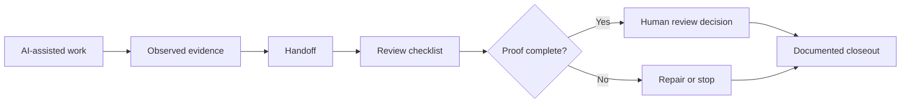
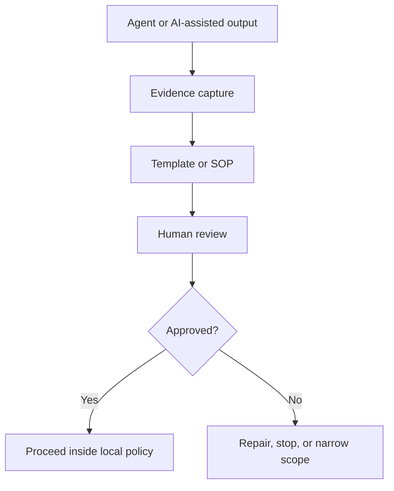

# Visual overview

This page gives a one-screen visual explanation of AI Ops SOP Pack.

## One-line idea

> AI-assisted engineering work needs evidence, handoff discipline, and human review before claims of readiness.

## The pack flow



Plain meaning:

1. AI-assisted work produces something.
2. The operator records observed evidence.
3. A handoff captures state, risks, and next action.
4. A review checklist prevents unsafe readiness claims.
5. Missing proof leads to repair or stop, not forced approval.
6. Human review remains explicit.

## What to use first

| Need | Start with | Template |
| --- | --- | --- |
| Transfer work between people or agents | `content/04_agent_handoff_format.md` | `templates/agent_handoff_template.md` |
| Final PR review before merge | `content/02_pr_final_audit_head_guard_sop.md` | `templates/pr_final_audit_checklist.md` |
| Recover after crash or OOM | `content/01_oom_recovery_sop.md` | `templates/oom_recovery_checklist.md` |
| Restart local workstation context | `content/03_cold_start_operator_runbook.md` | `templates/cold_start_checklist.md` |
| Understand the full case study | `content/05_operator_guide.md` | none |

## Evidence vs claim

| Statement | Accept? | Why |
| --- | --- | --- |
| "The work is ready" | No | Claim only |
| "Tests passed locally" | Maybe | Needs command, output, scope, timestamp |
| "CI passed on commit X" | Stronger | Needs commit, check name, status |
| "Merge is safe" | Not automatically | Needs head guard, diff, checks, approval boundary |
| "Handoff complete" | Only if structured | Needs status, files, commands, risks, next action |

## Human review boundary



Plain meaning:

- The pack helps document and review work.
- It does not approve work by itself.
- It does not grant merge, runtime, provider, sales, or publication authority.

## Mental model

```text
No evidence -> no readiness claim
No handoff -> no reliable transfer
No head guard -> no safe PR final audit
No approval -> no permission-to-act
No local adaptation -> no operational use
```

## Reader map

| Reader | Best first file |
| --- | --- |
| Non-technical visitor | `START_HERE.md` |
| Engineering manager | `README.md` then `content/04_agent_handoff_format.md` |
| Developer | `templates/` then matching SOP |
| SRE / platform reviewer | PR audit and OOM recovery SOPs |
| Compliance or risk reviewer | `STATUS.md`, README non-goals, and handoff format |

## What this pack is not

| It is | It is not |
| --- | --- |
| A Markdown SOP pack | A runtime |
| A review discipline | A certification |
| A template library | A permission system |
| A public documentation release | A sales asset or commercial offer |
| A way to reduce false readiness claims | A guarantee of safety in your environment |
